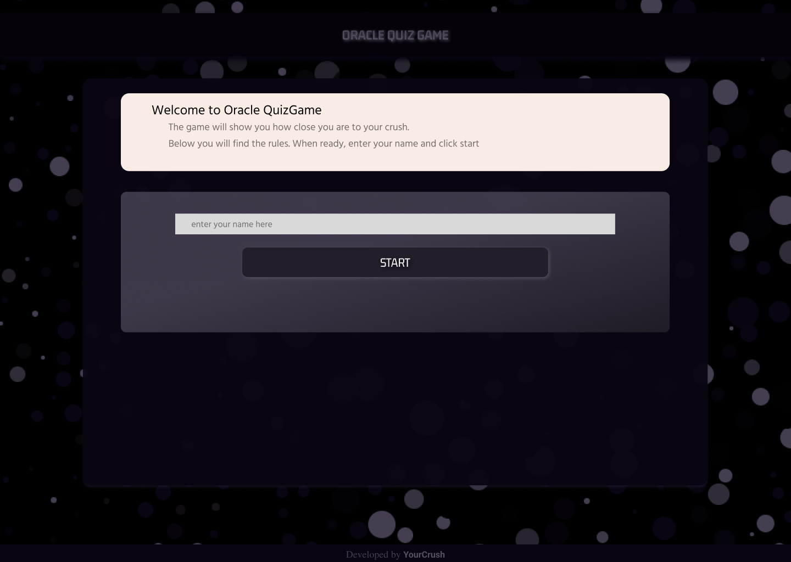

# A Quiz Game App

This project was bootstrapped with [Create React App](https://github.com/facebook/create-react-app).

## Available Scripts

In the project directory, you can run:
### `npm start`

Runs the app
Open [http://localhost:3000](http://localhost:3000) to view it in your browser.

The page will reload when you make changes.\
You may also see any lint errors in the console.

## Palette color codes
Mode: CSS - Cascading Style Sheet
Palette URL: [http://paletton.com/#uid=14k0u0kpC3m8jeL8jeLT+00+Q00](http://paletton.com/#uid=14k0u0kpC3m8jeL8jeLT+00+Q00)

As hex codes:

.color-primary-0 { color: #090512 }	/* Main Primary color */ \
.color-primary-1 { color: #443E50 }\
.color-primary-2 { color: #443E50 }\
.color-primary-3 { color: #000000 }\
.color-primary-4 { color: #000000 }

\
As RGBa codes:

.rgba-primary-0 { color: rgba(  9,  5, 18,1) }	/* Main Primary color */ \
.rgba-primary-1 { color: rgba( 68, 62, 80,1) }\
.rgba-primary-2 { color: rgba( 68, 62, 80,1) }\
.rgba-primary-3 { color: rgba(  0,  0,  0,1) }\
.rgba-primary-4 { color: rgba(  0,  0,  0,1) }

Generated by [Paletton.com](http://paletton.com) © 2002-2014

## Design
Design made in Figma  
[Click here to view in browser](https://www.figma.com/file/1AymQIa8Os3KMC2Vy3jChG/Oracle-Quiz-Game?node-id=0%3A1&t=YD8dw441M6dfUSi4-1) \

### Protype

[Click Here to view in browser](https://www.figma.com/proto/1AymQIa8Os3KMC2Vy3jChG/Oracle-Quiz-Game?node-id=101%3A46&scaling=min-zoom&page-id=0%3A1&starting-point-node-id=101%3A46)  

